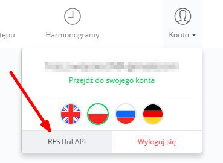

# SUPLA-API-CLIENT for PHP
 
 [](https://github.com/SUPLA/api-client-php/releases/latest)
 [](https://travis-ci.org/SUPLA/supla-cloud)
 [](https://packagist.org/packages/supla/api-client)

Your home connected. www.supla.org

# Installation

Install with [Composer](https://getcomposer.org/).

```
composer require supla/api-client
```

# Configuration

Get the API configuration values from the SUPLA-CLOUD you use.
You can find them on the *RESTFUL API* page after enabling it.



Then create an instance of a client in your code.

```php
<?php
$client = new \Supla\ApiClient\SuplaApiClient([
    'server' => 'svrX.supla.org',
    'clientId' => 'YOUR_CLIENT_ID',
    'secret' => 'YOUR_SECRET',
    'username' => 'YOUR_USERNAME',
    'password' => 'YOUR_PASSWORD',
]);
```

# Usage

### Getting server info

```
$client->getServerInfo();
```

TODO

